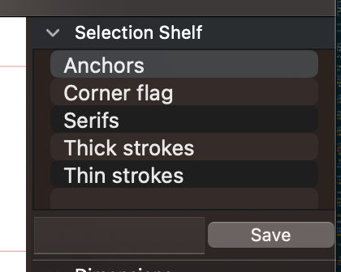

# Selection Shelf

*This is a palette plugin for the Glyphs font editor.*

It adds a new palette to the sidebar allowing to store and retrieve named selection sets.

If you have certain nodes that you are often selecting and referring to, you can save them as a named selection by typing a name in the text field and clicking "Save". To retrieve the selection later, double click on its name in the list. If you have no longer any need for the selection, click on it in the list and press Delete to remove it.

